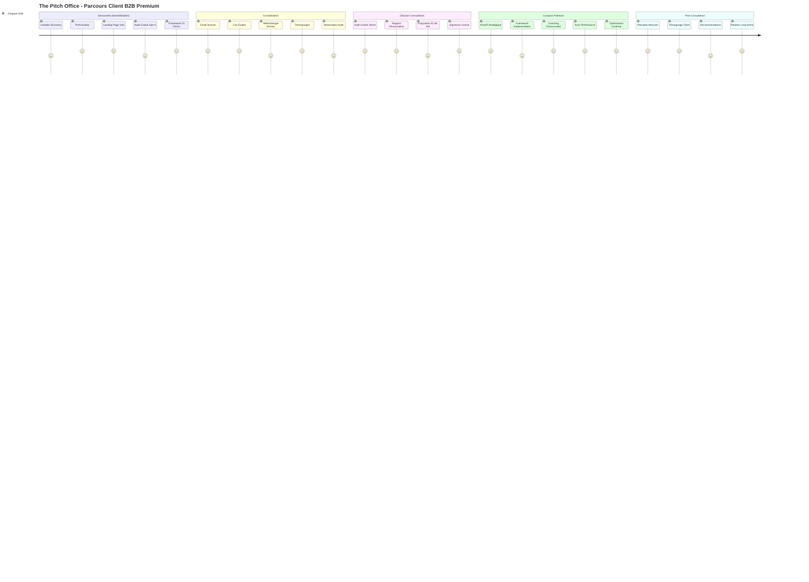
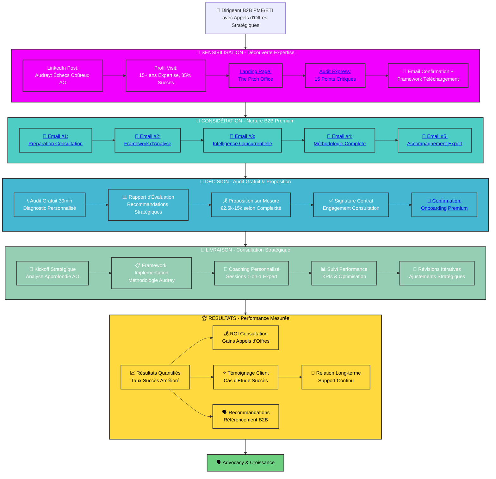
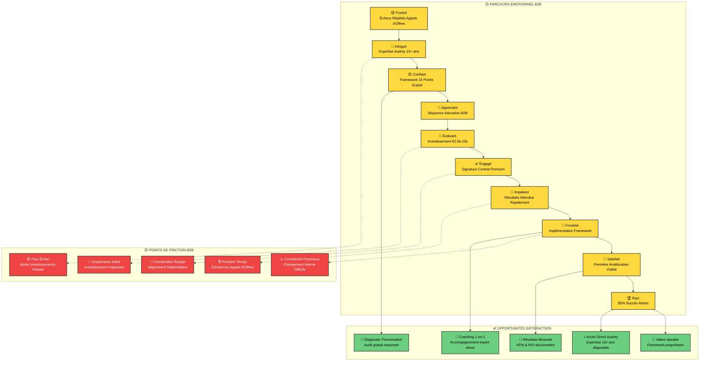
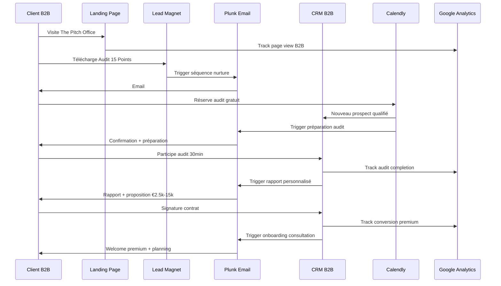

# Customer Journey Flowchart - The Pitch Office
*Cartographie complète du parcours client pour la consultation B2B premium*

## Complete Customer Journey Flow - The Pitch Office



## Detailed User Flow with Touchpoints - The Pitch Office



## Service Blueprint - The Pitch Office Premium

```mermaid
flowchart TD
    subgraph FRONTSTAGE[🎭 FRONTSTAGE - Client Facing]
        F1[📱 LinkedIn Stratégie Contenu<br/>Expertise Audrey & Échecs Coûteux]
        F2[🌐 <a href="../html/index.html" target="_blank">Landing Page Premium<br/>The Pitch Office Professionnel</a>]
        F3[📧 Séquences Email B2B<br/>Nurture 5 touchpoints expertise]
        F4[💼 Audit Gratuit 30min<br/>Diagnostic personnalisé]
        F5[📊 Rapport d'Évaluation<br/>Recommandations stratégiques]
        F6[🤝 Consultation Premium<br/>€2.5k-15k selon complexité]
        F7[👥 Coaching 1-on-1<br/>Sessions expert personnalisées]
        F8[📈 Dashboard Résultats<br/>Suivi performance & ROI]
    end
    
    subgraph LINE[------- LINE OF VISIBILITY -------]
        INVISIBLE[👁️ Client ne voit pas en-dessous]
    end
    
    subgraph BACKSTAGE[🎭 BACKSTAGE - Processus Internes]
        B1[📧 Automation Plunk<br/>Triggers comportementaux B2B]
        B2[🔍 Qualification Lead<br/>Scoring & segmentation PME/ETI]
        B3[📋 Framework Preparation<br/>Templates audit personnalisés]
        B4[📊 Analytics Avancés<br/>GA4 + Hotjar comportemental]
        B5[💼 CRM B2B Management<br/>Pipeline consultation premium]
        B6[🎯 Support Client Tiered<br/>Escalation expertise Audrey]
        B7[📈 Performance Monitoring<br/>KPIs consultation & optimisation]
    end
    
    subgraph SUPPORT[🏗️ PROCESSUS SUPPORT]
        S1[💾 Gestion Données Client<br/>CRM B2B + historique AO]
        S2[📈 Revenue Analytics<br/>Facturation €2.5k-15k + reporting]
        S3[🎨 Content Pipeline<br/>Cas études + LinkedIn expertise]
        S4[🔍 SEO & Acquisition<br/>Trafic organique consultation AO]
        S5[🎯 Quality Assurance<br/>Standards consultation premium]
        S6[🔄 Feedback Integration<br/>Amélioration continue processus]
    end
    
    %% Connections
    F1 --> B3
    F2 --> B1
    F3 --> B1
    F4 --> B2
    F5 --> B5
    F6 --> B5
    F7 --> B6
    F8 --> B4
    
    B1 --> S1
    B2 --> S1
    B3 --> S6
    B4 --> S6
    B5 --> S2
    B6 --> S6
    B7 --> S5
    
    %% Styling
    classDef frontstage fill:#4ecdc4,stroke:#333,stroke-width:2px,color:#fff
    classDef backstage fill:#F200FF,stroke:#333,stroke-width:2px,color:#fff
    classDef support fill:#96ceb4,stroke:#333,stroke-width:2px,color:#fff
    classDef line fill:#333,stroke:#333,stroke-width:3px,color:#fff
    
    class F1,F2,F3,F4,F5,F6,F7,F8 frontstage
    class B1,B2,B3,B4,B5,B6,B7 backstage
    class S1,S2,S3,S4,S5,S6 support
    class LINE,INVISIBLE line
```



## Emotional Journey & Pain Points - The Pitch Office



## Conversion Funnel - The Pitch Office Premium

```mermaid
funnel
    title The Pitch Office - Funnel Consultation B2B
    LinkedIn Discovery --> 5000
    Landing Page Visit --> 800
    Audit Gratuit Opt-in --> 150
    Email Nurture Complete --> 100
    Audit Gratuit Réservé --> 50
    Proposition Reçue --> 40
    Contrat Signé --> 12
    Consultation Complétée --> 11
    Témoignage Fourni --> 9
    Recommandation Générée --> 5
```

## Technical Integration Flow - The Pitch Office



## Integration with The Pitch Office Platform

**HTML Touchpoints Intégrés:**
- **Page Principale**: [The Pitch Office Homepage](../html/index.html){:target="_blank"}
- **Lead Magnet**: [Audit Stratégique 15 Points](../html/lead%20magnet/mvp-validation-checklist.html){:target="_blank"}
- **Confirmation**: [Page Succès Audit](../html/success.html){:target="_blank"}
- **Séquences Email**: [Templates Consultation B2B](../html/email%20template/){:target="_blank"}

**Use these flowcharts to:**
1. **Visualiser l'expérience client complète** de la découverte à l'advocacy
2. **Identifier les opportunités d'optimisation** dans le funnel consultation
3. **Comprendre la livraison de service** front et backstage premium  
4. **Planifier les intégrations techniques** pour une expérience seamless
5. **Monitorer le parcours émotionnel** et adresser les points de friction
6. **Maintenir la cohérence de marque** avec positionnement €2.5k-15k

**Key Insight**: Le parcours client montre pourquoi l'audit gratuit 30min est critique - il construit la confiance avant l'investissement consultation premium €2.5k-15k avec l'expertise 15+ ans d'Audrey.