# Customer Journey Flowchart - The Pitch Office
*Cartographie complète du parcours client pour la consultation B2B premium*

## Complete Customer Journey Flow - The Pitch Office


## Detailed User Flow with Touchpoints - The Pitch Office

```mermaid
flowchart TD
    START[👔 Dirigeant B2B PME/ETI avec Appels d'Offres Stratégiques] --> AWARENESS[📱 SENSIBILISATION]
    
    subgraph AWARENESS[📱 SENSIBILISATION - Découverte Expertise]
        A1[LinkedIn Post:<br/>Audrey: Échecs Coûteux AO] --> A2[Profil Visit:<br/>15+ ans Expertise, 85% Succès]
        A2 --> A3[<a href="../html/index.html" target="_blank">Landing Page:<br/>The Pitch Office</a>]
        A3 --> A4[<a href="../html/lead magnet/mvp-validation-checklist.html" target="_blank">Audit Express:<br/>15 Points Critiques</a>]
        A4 --> A5[📧 Email Confirmation +<br/>Framework Téléchargement]
    end
    
    AWARENESS --> CONSIDERATION[🤔 CONSIDÉRATION]
    
    subgraph CONSIDERATION[🤔 CONSIDÉRATION - Nurture B2B Premium]
        C1[<a href="../html/email template/01-welcome.html" target="_blank">📧 Email #1:<br/>Préparation Consultation</a>]
        C2[<a href="../html/email template/02-foundation.html" target="_blank">📧 Email #2:<br/>Framework d'Analyse</a>]
        C3[<a href="../html/email template/03-customer-research.html" target="_blank">📧 Email #3:<br/>Intelligence Concurrentielle</a>]
        C4[<a href="../html/email template/04-methodologie-complete.html" target="_blank">📧 Email #4:<br/>Méthodologie Complète</a>]
        C5[<a href="../html/email template/05-accompagnement-continu.html" target="_blank">📧 Email #5:<br/>Accompagnement Expert</a>]
        
        C1 --> C2 --> C3 --> C4 --> C5
    end
    
    CONSIDERATION --> DECISION[💼 DÉCISION CONSULTATION]
    
    subgraph DECISION[💼 DÉCISION - Audit Gratuit & Proposition]
        D1[📞 Audit Gratuit 30min<br/>Diagnostic Personnalisé]
        D2[📊 Rapport d'Évaluation<br/>Recommandations Stratégiques]
        D3[💰 Proposition sur Mesure<br/>€2.5k-15k selon Complexité]
        D4[✅ Signature Contrat<br/>Engagement Consultation]
        D5[<a href="../html/success.html" target="_blank">📧 Confirmation:<br/>Onboarding Premium</a>]
        
        D1 --> D2 --> D3 --> D4 --> D5
    end
    
    DECISION --> DELIVERY[🚀 LIVRAISON PREMIUM]
    
    subgraph DELIVERY[🚀 LIVRAISON - Consultation Stratégique]
        L1[🎯 Kickoff Stratégique<br/>Analyse Approfondie AO]
        L2[📋 Framework Implementation<br/>Méthodologie Audrey]
        L3[👥 Coaching Personnalisé<br/>Sessions 1-on-1 Expert]
        L4[📊 Suivi Performance<br/>KPIs & Optimisation]
        L5[🔄 Révisions Itératives<br/>Ajustements Stratégiques]
        
        L1 --> L2 --> L3 --> L4 --> L5
    end
    
    DELIVERY --> RESULTS[🏆 RÉSULTATS & SUIVI]
    
    subgraph RESULTS[🏆 RÉSULTATS - Performance Mesurée]
        R1[📈 Résultats Quantifiés<br/>Taux Succès Amélioré]
        R2[💰 ROI Consultation<br/>Gains Appels d'Offres]
        R3[⭐ Témoignage Client<br/>Cas d'Étude Succès]
        R4[🤝 Relation Long-terme<br/>Support Continu]
        R5[🗣️ Recommandations<br/>Référencement B2B]
        
        R1 --> R2
        R1 --> R3 --> R4
        R1 --> R5
    end
    
    RESULTS --> ADVOCACY[🗣️ Advocacy & Croissance]
    
    %% Styling
    classDef awareness fill:#F200FF,stroke:#333,stroke-width:2px,color:#fff
    classDef consideration fill:#4ecdc4,stroke:#333,stroke-width:2px,color:#fff
    classDef decision fill:#45b7d1,stroke:#333,stroke-width:2px,color:#fff
    classDef delivery fill:#96ceb4,stroke:#333,stroke-width:2px,color:#fff
    classDef results fill:#ffd93d,stroke:#333,stroke-width:2px,color:#000
    classDef completion fill:#6bcf7f,stroke:#333,stroke-width:2px,color:#000
    
    class AWARENESS,A1,A2,A3,A4,A5 awareness
    class CONSIDERATION,C1,C2,C3,C4,C5 consideration
    class DECISION,D1,D2,D3,D4,D5 decision
    class DELIVERY,L1,L2,L3,L4,L5 delivery
    class RESULTS,R1,R2,R3,R4,R5 results
    class ADVOCACY completion
```



## Service Blueprint - The Pitch Office Premium

```mermaid
flowchart TD
    subgraph FRONTSTAGE[🎭 FRONTSTAGE - Client Facing]
        F1[📱 LinkedIn Stratégie Contenu<br/>Expertise Audrey & Échecs Coûteux]
        F2[🌐 <a href="../html/index.html" target="_blank">Landing Page Premium<br/>The Pitch Office Professionnel</a>]
        F3[📧 Séquences Email B2B<br/>Nurture 5 touchpoints expertise]
        F4[💼 Audit Gratuit 30min<br/>Diagnostic personnalisé]
        F5[📊 Rapport d'Évaluation<br/>Recommandations stratégiques]
        F6[🤝 Consultation Premium<br/>€2.5k-15k selon complexité]
        F7[👥 Coaching 1-on-1<br/>Sessions expert personnalisées]
        F8[📈 Dashboard Résultats<br/>Suivi performance & ROI]
    end
    
    subgraph LINE[------- LINE OF VISIBILITY -------]
        INVISIBLE[👁️ Client ne voit pas en-dessous]
    end
    
    subgraph BACKSTAGE[🎭 BACKSTAGE - Processus Internes]
        B1[📧 Automation Plunk<br/>Triggers comportementaux B2B]
        B2[🔍 Qualification Lead<br/>Scoring & segmentation PME/ETI]
        B3[📋 Framework Preparation<br/>Templates audit personnalisés]
        B4[📊 Analytics Avancés<br/>GA4 + Hotjar comportemental]
        B5[💼 CRM B2B Management<br/>Pipeline consultation premium]
        B6[🎯 Support Client Tiered<br/>Escalation expertise Audrey]
        B7[📈 Performance Monitoring<br/>KPIs consultation & optimisation]
    end
    
    subgraph SUPPORT[🏗️ PROCESSUS SUPPORT]
        S1[💾 Gestion Données Client<br/>CRM B2B + historique AO]
        S2[📈 Revenue Analytics<br/>Facturation €2.5k-15k + reporting]
        S3[🎨 Content Pipeline<br/>Cas études + LinkedIn expertise]
        S4[🔍 SEO & Acquisition<br/>Trafic organique consultation AO]
        S5[🎯 Quality Assurance<br/>Standards consultation premium]
        S6[🔄 Feedback Integration<br/>Amélioration continue processus]
    end
    
    %% Connections
    F1 --> B3
    F2 --> B1
    F3 --> B1
    F4 --> B2
    F5 --> B5
    F6 --> B5
    F7 --> B6
    F8 --> B4
    
    B1 --> S1
    B2 --> S1
    B3 --> S6
    B4 --> S6
    B5 --> S2
    B6 --> S6
    B7 --> S5
    
    %% Styling
    classDef frontstage fill:#4ecdc4,stroke:#333,stroke-width:2px,color:#fff
    classDef backstage fill:#F200FF,stroke:#333,stroke-width:2px,color:#fff
    classDef support fill:#96ceb4,stroke:#333,stroke-width:2px,color:#fff
    classDef line fill:#333,stroke:#333,stroke-width:3px,color:#fff
    
    class F1,F2,F3,F4,F5,F6,F7,F8 frontstage
    class B1,B2,B3,B4,B5,B6,B7 backstage
    class S1,S2,S3,S4,S5,S6 support
    class LINE,INVISIBLE line
```



## Emotional Journey & Pain Points - The Pitch Office

```mermaid
graph TD
    subgraph EMOTIONS[😊 PARCOURS ÉMOTIONNEL B2B]
        E1[😟 Frustré<br/>Échecs Répétés Appels d'Offres]
        E2[🤔 Intrigué<br/>Expertise Audrey 15+ ans]
        E3[😊 Confiant<br/>Framework 15 Points Gratuit]
        E4[🧠 Apprenant<br/>Séquence éducation B2B]
        E5[💭 Évaluant<br/>Investissement €2.5k-15k]
        E6[✅ Engagé<br/>Signature Contrat Premium]
        E7[😤 Impatient<br/>Résultats Attendus Rapidement]
        E8[💪 Focalisé<br/>Implémentation Framework]
        E9[🎯 Satisfait<br/>Première Amélioration Visible]
        E10[🏆 Ravi<br/>85% Succès Atteint]
    end
    
    subgraph PAINPOINTS[😣 POINTS DE FRICTION B2B]
        P1[🚫 Scepticisme Initial<br/>Investissement Important]
        P2[⏰ Pression Temps<br/>Échéances Appels d'Offres]
        P3[⚠️ Complexité Processus<br/>Changement Interne Difficile]
        P4[😰 Peur Échec<br/>Après Investissements Passés]
        P5[📱 Coordination Équipe<br/>Alignement Stakeholders]
    end
    
    subgraph SOLUTIONS[✅ OPPORTUNITÉS SATISFACTION]
        S1[🎯 Diagnostic Personnalisé<br/>Audit gratuit rassurant]
        S2[👥 Coaching 1-on-1<br/>Accompagnement expert direct]
        S3[🏅 Résultats Mesurés<br/>KPIs & ROI documentés]
        S4[🎁 Valeur Ajoutée<br/>Framework propriétaire]
        S5[📞 Accès Direct Audrey<br/>Expertise 15+ ans disponible]
    end
    
    %% Flow
    E1 --> E2 --> E3 --> E4 --> E5 --> E6 --> E7 --> E8 --> E9 --> E10
    
    %% Pain point connections
    E5 -.-> P1
    E7 -.-> P2
    E8 -.-> P3
    E2 -.-> P4
    E6 -.-> P5
    
    %% Solution connections
    E3 --> S1
    E8 --> S2
    E9 --> S3
    E10 --> S4
    E10 --> S5
    
    %% Styling
    classDef emotions fill:#ffd93d,stroke:#333,stroke-width:2px,color:#000
    classDef pain fill:#ef4444,stroke:#333,stroke-width:2px,color:#fff
    classDef delight fill:#6bcf7f,stroke:#333,stroke-width:2px,color:#000
    
    class E1,E2,E3,E4,E5,E6,E7,E8,E9,E10 emotions
    class P1,P2,P3,P4,P5 pain
    class S1,S2,S3,S4,S5 delight
```



## Conversion Funnel - The Pitch Office Premium

```mermaid
funnel
    title The Pitch Office - Funnel Consultation B2B
    LinkedIn Discovery --> 5000
    Landing Page Visit --> 800
    Audit Gratuit Opt-in --> 150
    Email Nurture Complete --> 100
    Audit Gratuit Réservé --> 50
    Proposition Reçue --> 40
    Contrat Signé --> 12
    Consultation Complétée --> 11
    Témoignage Fourni --> 9
    Recommandation Générée --> 5
```

## Technical Integration Flow - The Pitch Office

```mermaid
sequenceDiagram
    participant C as Client B2B
    participant LP as Landing Page
    participant LM as Lead Magnet
    participant P as Plunk Email
    participant CRM as CRM B2B
    participant CAL as Calendly
    participant GA as Google Analytics
    
    C->>LP: Visite The Pitch Office
    LP->>GA: Track page view B2B
    C->>LM: Télécharge Audit 15 Points
    LM->>P: Trigger séquence nurture
    P->>C: Email #1 - Préparation
    
    C->>CAL: Réserve audit gratuit
    CAL->>CRM: Nouveau prospect qualifié
    CAL->>P: Trigger préparation audit
    P->>C: Confirmation + préparation
    
    C->>CRM: Participe audit 30min
    CRM->>GA: Track audit completion
    CRM->>P: Trigger rapport personnalisé
    P->>C: Rapport + proposition €2.5k-15k
    
    C->>CRM: Signature contrat
    CRM->>GA: Track conversion premium
    CRM->>P: Trigger onboarding consultation
    P->>C: Welcome premium + planning
```



## Integration with The Pitch Office Platform

**HTML Touchpoints Intégrés:**
- **Page Principale**: [The Pitch Office Homepage](../html/index.html){:target="_blank"}
- **Lead Magnet**: [Audit Stratégique 15 Points](../html/lead%20magnet/mvp-validation-checklist.html){:target="_blank"}
- **Confirmation**: [Page Succès Audit](../html/success.html){:target="_blank"}
- **Séquences Email**: [Templates Consultation B2B](../html/email%20template/){:target="_blank"}

**Use these flowcharts to:**
1. **Visualiser l'expérience client complète** de la découverte à l'advocacy
2. **Identifier les opportunités d'optimisation** dans le funnel consultation
3. **Comprendre la livraison de service** front et backstage premium  
4. **Planifier les intégrations techniques** pour une expérience seamless
5. **Monitorer le parcours émotionnel** et adresser les points de friction
6. **Maintenir la cohérence de marque** avec positionnement €2.5k-15k

**Key Insight**: Le parcours client montre pourquoi l'audit gratuit 30min est critique - il construit la confiance avant l'investissement consultation premium €2.5k-15k avec l'expertise 15+ ans d'Audrey.