# Master Plan Generation Flowchart - The Pitch Office
*Méthodologie stratégique pour la transformation en plateforme de consultation B2B*

## Sequential Generation Order Flow - The Pitch Office

```mermaid
graph TD
    A[🎯 START: The Pitch Office Setup] --> B[📊 PHASE 1: STRATEGIC FOUNDATION]
    
    B --> C[1️⃣ product_brain.md<br/>📝 Définition Méthodologie The Pitch Office<br/>⏱️ 2 hours]
    C --> D[2️⃣ prd-strategy.md<br/>📋 Framework Consultation B2B<br/>⏱️ 1 hour]
    D --> E[3️⃣ README.md<br/>📖 Vue d'ensemble The Pitch Office<br/>⏱️ 30 minutes]
    
    E --> F[📈 PHASE 2: CLIENT ACQUISITION STRATEGY]
    
    F --> G[4️⃣ customer_journey_blueprint.md<br/>🗺️ Parcours Client B2B Premium<br/>⏱️ 3 hours]
    G --> H[5️⃣ linkedin_strategy.md<br/>📱 Stratégie Contenu Expertise<br/>⏱️ 1.5 hours]
    H --> I[6️⃣ PROJECT-STATUS.md<br/>📊 Dashboard Performance<br/>⏱️ 1 hour]
    
    I --> J[🔧 PHASE 3: PREMIUM DELIVERY FRAMEWORK]
    
    J --> K[7️⃣ sprint-0-foundation.md<br/>🏗️ Setup Consultation<br/>⏱️ 2 hours]
    K --> L[8️⃣ mvp-validation-checklist.md<br/>✅ Framework Audit Appels d'Offres<br/>⏱️ 2.5 hours]
    L --> M[9️⃣ setup-guide.md<br/>⚙️ Processus Consultation Stratégique<br/>⏱️ 1.5 hours]
    
    M --> N[🎨 PHASE 4: OPTIMIZATION & SCALING]
    
    N --> O[🔟 customization-guide.md<br/>🔄 Adaptation Secteurs B2B<br/>⏱️ 2 hours]
    N --> P[1️⃣1️⃣ UX-AUDIT-REPORT.md<br/>🎯 Analyse Expérience Client<br/>⏱️ 2 hours]
    O --> Q[1️⃣2️⃣ CLAUDE.md<br/>🛠️ Procédures Développement<br/>⏱️ 1 hour]
    P --> Q
    
    Q --> R[🚀 COMPLETE: The Pitch Office Premium Platform<br/>€2.5k-15k Revenue Tiers Ready]
    
    %% Dependencies
    C -.-> G
    C -.-> H
    G -.-> K
    G -.-> L
    K -.-> M
    I -.-> P
    
    %% Styling
    classDef phase1 fill:#F200FF,stroke:#333,stroke-width:2px,color:#fff
    classDef phase2 fill:#4ecdc4,stroke:#333,stroke-width:2px,color:#fff
    classDef phase3 fill:#45b7d1,stroke:#333,stroke-width:2px,color:#fff
    classDef phase4 fill:#96ceb4,stroke:#333,stroke-width:2px,color:#fff
    classDef start fill:#ffd93d,stroke:#333,stroke-width:3px,color:#000
    classDef complete fill:#6bcf7f,stroke:#333,stroke-width:3px,color:#000
    
    class A start
    class B,C,D,E phase1
    class F,G,H,I phase2
    class J,K,L,M phase3
    class N,O,P,Q phase4
    class R complete
```

## Critical Dependencies Matrix - The Pitch Office

```mermaid
graph LR
    subgraph "Foundation Dependencies"
        PB[product_brain.md<br/>Méthodologie Core] --> ALL[Tous Autres Documents]
        PS[prd-strategy.md<br/>Framework B2B] --> MVC[Audit Framework]
        README[README.md<br/>Vue d'ensemble] --> STATUS[Dashboard Performance]
    end
    
    subgraph "Strategy Dependencies"
        CJ[customer_journey_blueprint.md<br/>Parcours Client Premium] --> EXEC[Documents Exécution 7-12]
        LS[linkedin_strategy.md<br/>Stratégie Expertise] --> STATUS
    end
    
    subgraph "Execution Dependencies"
        SF[sprint-0-foundation.md<br/>Setup Consultation] --> SG[Processus Stratégique]
        MVC[Framework Audit] --> SG
        STATUS --> UX[Analyse Expérience]
    end
    
    subgraph "Optimization Dependencies"
        SG --> CG[Adaptation Secteurs]
        UX --> CLAUDE[Procédures Dev]
        CG --> CLAUDE
    end
    
    %% Styling
    classDef foundation fill:#F200FF,stroke:#333,stroke-width:2px,color:#fff
    classDef strategy fill:#4ecdc4,stroke:#333,stroke-width:2px,color:#fff
    classDef execution fill:#45b7d1,stroke:#333,stroke-width:2px,color:#fff
    classDef optimization fill:#96ceb4,stroke:#333,stroke-width:2px,color:#fff
    
    class PB,PS,README foundation
    class CJ,LS strategy
    class SF,MVC,SG,STATUS execution
    class CG,UX,CLAUDE optimization
```

## Parallel Generation Opportunities - The Pitch Office

## Quality Gate Checkpoints - The Pitch Office

```mermaid
flowchart TD
    START([🎯 Begin The Pitch Office Generation]) --> P1{Phase 1 Complete?}
    
    P1 -->|❌ No| P1_CHECK[Check: Méthodologie The Pitch Office<br/>clairement définie?]
    P1_CHECK --> P1_FIX[Fix: Renforcer product_brain.md<br/>avec expertise Audrey 15+ ans]
    P1_FIX --> P1
    
    P1 -->|✅ Yes| P2{Phase 2 Complete?}
    
    P2 -->|❌ No| P2_CHECK[Check: Parcours client B2B<br/>€2.5k-15k mappé?]
    P2_CHECK --> P2_FIX[Fix: Affiner customer_journey_blueprint.md<br/>avec consultation premium]
    P2_FIX --> P2
    
    P2 -->|✅ Yes| P3{Phase 3 Complete?}
    
    P3 -->|❌ No| P3_CHECK[Check: Processus consultation<br/>reproductible par équipe?]
    P3_CHECK --> P3_FIX[Fix: Détailler documents exécution<br/>avec framework audit]
    P3_FIX --> P3
    
    P3 -->|✅ Yes| P4{Phase 4 Complete?}
    
    P4 -->|❌ No| P4_CHECK[Check: Système optimisé<br/>pour croissance B2B?]
    P4_CHECK --> P4_FIX[Fix: Améliorer docs optimisation<br/>et scalabilité]
    P4_FIX --> P4
    
    P4 -->|✅ Yes| SUCCESS([🚀 The Pitch Office Complete<br/>Plateforme Consultation Premium Ready])
    
    %% Styling
    classDef checkpoint fill:#ffd93d,stroke:#333,stroke-width:2px,color:#000
    classDef fix fill:#F200FF,stroke:#333,stroke-width:2px,color:#fff
    classDef success fill:#6bcf7f,stroke:#333,stroke-width:3px,color:#000
    
    class P1,P2,P3,P4 checkpoint
    class P1_FIX,P2_FIX,P3_FIX,P4_FIX fix
    class SUCCESS success
```

## Emergency Recovery Protocols - The Pitch Office

```mermaid
flowchart TD
    STUCK([🚨 The Pitch Office Generation Stuck]) --> DIAGNOSE{What's the Issue?}
    
    DIAGNOSE -->|Strategic Gaps| STRATEGY[Return to product_brain.md<br/>Vérifier méthodologie Audrey<br/>et positionnement expert]
    DIAGNOSE -->|Implementation Issues| IMPL[Check Phase 3 dependencies<br/>Framework audit appels d'offres<br/>et processus consultation]
    DIAGNOSE -->|Client Journey Problems| UX[Audit customer_journey_blueprint.md<br/>Parcours B2B €2.5k-15k<br/>et touchpoints premium]
    DIAGNOSE -->|Technical Debt| TECH[Strengthen CLAUDE.md<br/>Procédures développement<br/>et maintenance plateforme]
    
    STRATEGY --> VALIDATE{Stratégie The Pitch Office<br/>Claire?}
    IMPL --> VALIDATE2{Dependencies<br/>Consultation Met?}
    UX --> VALIDATE3{Parcours Client B2B<br/>Valide?}
    TECH --> VALIDATE4{Procédures<br/>Solides?}
    
    VALIDATE -->|✅ Yes| CONTINUE([Continue Generation])
    VALIDATE -->|❌ No| STRATEGY
    
    VALIDATE2 -->|✅ Yes| CONTINUE
    VALIDATE2 -->|❌ No| IMPL
    
    VALIDATE3 -->|✅ Yes| CONTINUE
    VALIDATE3 -->|❌ No| UX
    
    VALIDATE4 -->|✅ Yes| CONTINUE
    VALIDATE4 -->|❌ No| TECH
    
    CONTINUE --> SUCCESS([🎯 Back on Track<br/>The Pitch Office Ready])
    
    %% Styling
    classDef emergency fill:#ef4444,stroke:#333,stroke-width:3px,color:#fff
    classDef recovery fill:#f59e0b,stroke:#333,stroke-width:2px,color:#000
    classDef success fill:#6bcf7f,stroke:#333,stroke-width:2px,color:#000
    
    class STUCK emergency
    class STRATEGY,IMPL,UX,TECH recovery
    class SUCCESS success
```

## Integration with The Pitch Office Platform

**HTML Touchpoints:**
- **Landing Page**: [The Pitch Office Homepage](../html/index.html){:target="_blank"}
- **Lead Magnet**: [Audit Stratégique Appels d'Offres](../html/lead%20magnet/mvp-validation-checklist.html){:target="_blank"}
- **Success Page**: [Confirmation Audit](../html/success.html){:target="_blank"}
- **Email Sequences**: [Templates Consultation B2B](../html/email%20template/){:target="_blank"}

**Use these flowcharts to:**
1. **Visualize dependencies** before starting The Pitch Office generation
2. **Track progress** through the 4 phases of consultation platform
3. **Identify bottlenecks** in premium service delivery setup
4. **Recovery quickly** when generation gets stuck
5. **Maintain brand consistency** with €2.5k-15k positioning

**Key Insight**: The flowchart shows why `product_brain.md` is the critical foundation - everything flows from Audrey's methodology and 15+ years expertise.